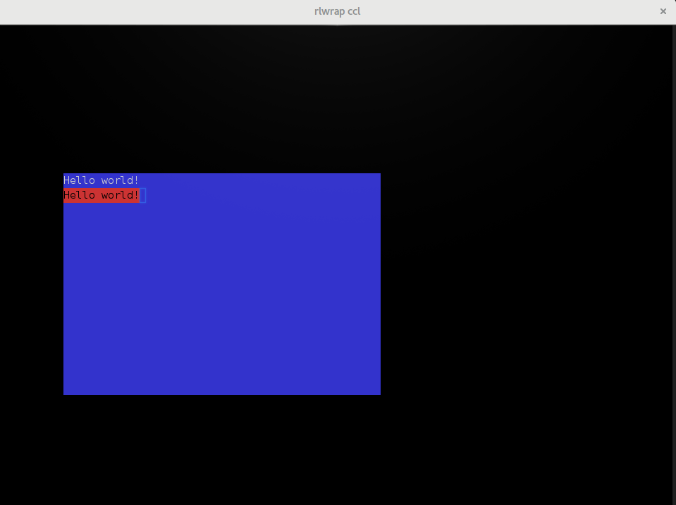

# Writing new CLIM backend

This work is meant as a showcase how to write new McCLIM backends. To make it
more interesting to me I'm writing it using `cl-charms` library which is a
Common Lisp library for `ncurses` - console manipulation library for UNIX
systems. During development I'm planning to make notes about necessary steps and
possibly provide general tests for McCLIM calling necessary system parts of the
backend (in order which reflects which parts must be implemented first). That
should simplify verifying, if new backends work fine.

## cl-charms crash course

Ensure you have ncurses development package installed on your system. Start the
real terminal (Emacs doesn't start `*inferior-lisp*` in something ncurses can
work with) and launch your implementation. After that start swank server and
connect from your Emacs session.

```
~ ccl
? (ql:quickload 'swank :silent t)
? (SWANK)
? (swank:create-server :port 4005 :dont-close t) 
;; Swank started at port: 4005.
4005
?
```

In Emacs: `M-x slime-connect *Host:* localhost *Port:* 4005`. Now we are working
in `*slime-repl ccl*` buffer in Emacs and we have ncurses output in the terminal
we have launched server from. Try some demos bundled with the library:

```
CL-USER> (ql:quickload '(cl-charms-paint cl-charms-timer) :silent t)
(CL-CHARMS-PAINT CL-CHARMS-TIMER)
CL-USER> (charms-timer:main) ; quit with Q, start/stop/reset with [SPACE]
CL-USER> (charms-paint:main) ; quit with Q, move with WSAD and paint with [SPACE]
```

Now we will go through various `charms` (and `ncurses`) capabilities. Our final
goal is to have a window with two buttons and text input box. Navigation should
be possible with `[TAB]` / `[SHIFT]+[TAB]` and by selecting gadgets with a mouse
pointer. Behold, time for the first application.

### First application

Time to write simple application.  Lets dissect a simple program printing hello
world:

```common-lisp
(defun hello-world ()
  (charms:with-curses ()
    (charms:disable-echoing)
    (charms:enable-raw-input)
    (loop named hello-world
       with window = (charms:make-window 50 50 10 10)
       do (progn
            (charms:clear-window window)
            (charms:write-string-at-point window "Hello world!" 0 0)
            (charms:refresh-window window)

            ;; Process input
            (when (eql (charms:get-char window) #\q)
              (return-from hello-world))
            (sleep 0.1)))))
```

Program must be wrapped in `charms:with-curses` macro which ensures proper
initialization and finalization of the problem. In this operator context
`charms` functions for configuring library are available. We use
`charms:disable-echoing` to prevent unnecessary obfuscation of window (we
interpret characters ourself) and `(charms:enable-raw-input)` to turn off line
buffering. `charms:*standard-window*` is a window covering whole terminal
screen.

We create a Window for output (its size is 50x15 and offset is 10x10) and then
in a loop we print "Hello world!" (at the top-left corner of it) until user
press `q`.

### Extending cl-charms API

All functions we have used until now come from higher-level
interface. `cl-charms` has also low-level interface which maps to libncurses via
CFFI (package `charms/ll`). I highly recommend skimming through
http://www.tldp.org/HOWTO/NCURSES-Programming-HOWTO which is a great overview of
`ncurses` functionality.

I want borders around our window, but CFFI interface is ugly (i.e I'd have to
extract window pointer to call `wborder`). We are going to abstract this with a
function which plays nice with the lispy abstraction.

```
(defun draw-window-border (window
                           &optional
                             (ls #\|) (rs #\|) (ts #\-) (bs #\-)
                             (tl #\+) (tr #\+) (bl #\+) (br #\+))
  (apply #'charms/ll:wborder (charms::window-pointer window)
         (mapcar #'char-code (list ls rs ts bs tl tr bl br))))

(defun draw-window-box (window &optional (verch #\|) (horch #\-))
  (charms/ll:box (charms::window-pointer window) (char-code verch) (char-code horch)))
```

Now we can freely use `draw-window-border` in our application. Put
`(draw-window-box window)` after `(charms:clear-window window)` in our
`hello-world` program and see the result. It is ugly, but what did you expect
from a window rendered in the terminal?


It is worth mentioning, that border is drawn inside the window, so when we start
writing string at point [0,0] - it overlaps with the border. If we want to paint
content *inside* the border we should start at least at [1,1] and stop at [48,13].

Somewhat more appealing result may be achieved by having distinct window
background instead of drawing a border with characters. To do that we need to
root in `charms/ll` interface once more. We define colors API.

```common-lisp
(defun start-color ()
  (when (eql (charms/ll:has-colors) charms/ll:FALSE)
    (error "Your terminal does not support color."))
  (let ((ret-code (charms/ll:start-color)))
    (if (= ret-code 0)
        T
        (error "start-color error ~s." ret-code))))

(eval-when (:load-toplevel :compile-toplevel :execute)
  (defconstant +black+   charms/ll:COLOR_BLACK)
  (defconstant +red+     charms/ll:COLOR_RED)
  (defconstant +green+   charms/ll:COLOR_GREEN)
  (defconstant +yellow+  charms/ll:COLOR_YELLOW)
  (defconstant +blue+    charms/ll:COLOR_BLUE)
  (defconstant +magenta+ charms/ll:COLOR_MAGENTA)
  (defconstant +cyan+    charms/ll:COLOR_CYAN)
  (defconstant +white+   charms/ll:COLOR_WHITE))

(defmacro define-color-pair ((name pair) foreground background)
  `(defparameter ,name (progn (charms/ll:init-pair ,pair ,foreground ,background)
                              (charms/ll:color-pair ,pair))))

(define-color-pair (+white/blue+ 1) +white+ +blue+)
(define-color-pair (+black/red+ 2) +black+ +red+)

(defun draw-window-background (window color-pair)
  (charms/ll:wbkgd (charms::window-pointer window) color-pair))

(defmacro with-colors ((window color-pair) &body body)
  (let ((winptr (gensym)))
    (alexandria:once-only (color-pair)
      `(let ((,winptr (charms::window-pointer ,window)))
         (charms/ll:wattron ,winptr ,color-pair)
         ,@body
         (charms/ll:wattroff ,winptr ,color-pair)))))
```

`start-color` must be called when we configure the library. We map `charm/ll`
constants to lisp constants and create `define-color-pair` macro. This
abstraction could be improved so we are not forced to supply pair numbers and
providing proper association between names and integers, but we skip that step
for brievity. We define two color pairs, function for filling a window
background and macro `with-colors` for drawing with a specified palette. Finally
we use our new abstraction in `pretty-hello-world` function:

```common-lisp
(defun pretty-hello-world ()
  (charms:with-curses ()
    (charms:disable-echoing)
    (charms:enable-raw-input)
    (start-color)
    (loop named hello-world
       with window = (charms:make-window 50 15 10 10)
       do (progn
            (charms:clear-window window)
            (draw-window-background window +white/blue+)
            (with-colors (window +white/blue+)
              (charms:write-string-at-point window "Hello world!" 0 0))
            (with-colors (window +black/red+)
              (charms:write-string-at-point window "Hello world!" 0 1))
            (charms:refresh-window window)

            ;; Process input
            (when (eql (charms:get-char window :ignore-error t) #\q)
              (return-from hello-world))
            (sleep 0.1)))))
```

Final result looks as promised in the function name – very pretty ;-)



### Asynchronous input

We are more demanding. Printing `Hello world!` doesn't satisfy our needs, we
want something more than a mere mortal – we want to interact with a brilliant
software we've just made while its running. Even more, we want to do it without
blocking amazing computations going on in our system. First we must to visualise
them so we know they happen. Modify your program loop to draw `Hello World!` in
different color on each iteration.

```common-lisp
(defun amazing-hello-world ()
  (charms:with-curses ()
    (charms:disable-echoing)
    (charms:enable-raw-input)
    (start-color)
    (loop named hello-world
       with window = (charms:make-window 50 15 10 10)
       for flip-flop = (not flip-flop)
       do (progn
            (charms:clear-window window)
            (draw-window-background window +white/blue+)
            (with-colors (window (if flip-flop
                                     +white/blue+
                                     +black/red+))
              (charms:write-string-at-point window "Hello world!" 0 0))
            (charms:refresh-window window)
            ;; Process input
            (when (eql (charms:get-char window :ignore-error t) #\q)
              (return-from hello-world))
            (sleep 1)))))
```

Something is not right. When we run `amazing-hello-world` to see it flipping –
it doesn't. Is our program flawed? Yes it is. We wait for each character to
verify, that user hasn't requested application exit. When you press space having
terminal as active input you proceed to the next iteration. Now we must think of
how to obtain input from user without halting the application.

To do that we can enable non blocking mode for our window.

    with window = (let ((win (charms:make-window 50 15 10 10)))
                    (charms:enable-non-blocking-mode win)
                    win)

This solution is not complete unfortunately. It works reasonably well, but we
have to wait a second (because "computation" is performed every second need so
we put `sleep` after get-char which is now necessary) before the character is
handled. It gets even worse if we notice, that pressing five times character `b`
and then `q` will delay processing by six seconds (characters are processed one
after another in different iterations with one second sleep between them). We
need something better.

I hear your internal scream: use threads! It is important to keep in mind, that
if you can get without threads you probably should (same applies for cache and
many other clever techniques which introduce even more clever bugs). Also
ncurses is not thread-safe. We are going to listen for events from all inputs
like select does and generate "recompute" event each second. On implementation
which support timers we could use them but we'll use... a thread to generate
"ticks". Note that we use a thread as asynchronous input rather than
asynchronous charms access.

```common-lisp
;;; asynchronous input hack (should be a mailbox!)
(defparameter *recompute-flag* nil "ugly and unsafe hack for communication")
(defparameter *recompute-thread* nil)

(defun start-recompute-thread ()
  (when *recompute-thread*
    (bt:destroy-thread *recompute-thread*))
  (setf *recompute-thread*
        (bt:make-thread
         #'(lambda ()
             (loop
                (sleep 1)
                (setf *recompute-flag* t))))))

(defun stop-recompute-thread ()
  (when *recompute-thread*
    (bt:destroy-thread *recompute-thread*)
    (setf *recompute-thread* nil)))
```

In this snippet we create an interface to start a thread which sets a global
flag. General solution should be a mailbox (or a thread-safe stream) where
asynchronous thread writes and event loop reads from. We will settle with this
hack though (it is a crash course not a book after all). Start recompute thread
in the background before you start new application. Note, that this code is not
thread-safe, we concurrently read and write to a global variable. We are also
very drastic with `bt:destroy-thread`, something not recommended in **any** code
which is not a demonstration like this one.

We also refactor input and output functions `display-amazing-hello-world` and
`get-amazing-hello-world-input`.

```common-lisp
(defun display-amazing-hello-world (window flip-flop)
  (charms:clear-window window)
  (draw-window-background window +white/blue+)
  (with-colors (window (if flip-flop
                           +white/blue+
                           +black/red+))
    (charms:write-string-at-point window "Hello world!" 0 0))
  (charms:refresh-window window))

(defun get-amazing-hello-world-input (window)
  (when *recompute-flag*
    (setf *recompute-flag* nil)
    (return-from get-amazing-hello-world-input :compute))
  (charms:get-char window :ignore-error t))
```

And finally improved application which takes asynchronous input without blocking.

```
(defun improved-amazing-hello-world ()
  (charms:with-curses ()
    (charms:disable-echoing)
    (charms:enable-raw-input)
    (start-color)
    (let ((window (charms:make-window 50 15 10 10))
          (flip-flop nil))
      (charms:enable-non-blocking-mode window)
      (display-amazing-hello-world window flip-flop)
      (loop named hello-world
         do (case (get-amazing-hello-world-input window)
              ((#\q #\Q) (return-from hello-world))
              (:compute (setf flip-flop (not flip-flop))
                        (display-amazing-hello-world window flip-flop))
              ;; don't be a pig to a processor
              (otherwise (sleep 1/60)))))))
```

When you are done with demo you may call `stop-recompute-thread` to spare your
image unnecessary flipping a global variable.

