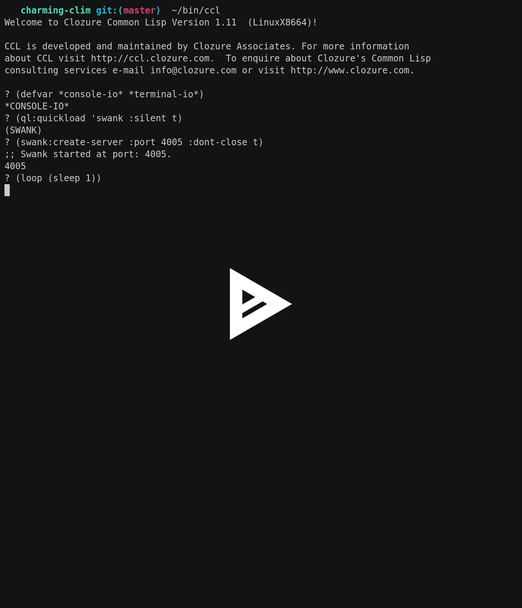

# Writing a new CLIM backend

This work is meant as a showcase how to write new McCLIM backend. To make it
more interesting to me I'm writing it using `cl-charms` library which is a
Common Lisp library for `ncurses` - console manipulation library for UNIX
systems. During development I'm planning to make notes about necessary steps. If
possible I'll also write a test suite for backends which will test the
functionality from most basic parts (like creating windows to more sophisticated
ones (transformations and drawing). That should simplify verifying, if new
backends work fine and to what degree it is complete. We start with a crash
course for `cl-charms` library.

# cl-charms crash course

Ensure you have `ncurses` development package installed on your system. Start
the real terminal (Emacs doesn't start `*inferior-lisp*` in something `ncurses`
can work with) and launch your implementation. I use `CCL` because usually
software is developed with `SBCL` and I want to catch as many problems with
`cl-charms` as possible. After that start swank server and connect from your
Emacs session.

```
~ ccl
? (defvar *console-io* *terminal-io*) ; we will need it later
*CONSOLE-IO*
? (ql:quickload 'swank :silent t)
(SWANK)
? (swank:create-server :port 4005 :dont-close t)
;; Swank started at port: 4005.
4005
? (loop (sleep 1))
```

We loop over sleep because we don't want console prompt to read our first line
for the console. If you don't do that you may have somewhat confusing behavior.

In Emacs: `M-x slime-connect *Host:* localhost *Port:* 4005`. Now we are working
in `*slime-repl ccl*` buffer in Emacs and we have ncurses output in the terminal
we have launched server from. Try some demos bundled with the library:

```
CL-USER> (ql:quickload '(cl-charms bordeaux-threads alexandria))
(CL-CHARMS BORDEAUX-THREADS ALEXANDRIA)
CL-USER> (ql:quickload '(cl-charms-paint cl-charms-timer) :silent t)
(CL-CHARMS-PAINT CL-CHARMS-TIMER)
CL-USER> (charms-timer:main) ; quit with Q, start/stop/reset with [SPACE]
CL-USER> (charms-paint:main) ; quit with Q, move with WSAD and paint with [SPACE]
```

Now we will go through various `charms` (and `ncurses`) capabilities. Our final
goal is to have a window with four buttons and text input box. Navigation should
be possible with `[TAB]` / `[SHIFT]+[TAB]` and by selecting gadgets with a mouse
pointer. Behold, time for the first application.

## First application

Lets dissect this simple program which prints "Hello world!" on the screen:

```common-lisp
(defun hello-world ()
  (charms:with-curses ()
    (charms:disable-echoing)
    (charms:enable-raw-input)
    (loop named hello-world
       with window = (charms:make-window 50 50 10 10)
       do (progn
            (charms:clear-window window)
            (charms:write-string-at-point window "Hello world!" 0 0)
            (charms:refresh-window window)

            ;; Process input
            (when (eql (charms:get-char window) #\q)
              (return-from hello-world))
            (sleep 0.1)))))
```

Program must be wrapped in `charms:with-curses` macro which ensures proper
initialization and finalization of the program. In this operator context
`charms` functions which configure the library are available. We use
`charms:disable-echoing` to prevent unnecessary obfuscation of the window (we
interpret characters ourself) and `(charms:enable-raw-input)` to turn off line
buffering. `charms:*standard-window*` is a window covering whole terminal
screen.

We create a Window for output (its size is 50x15 and offset is 10x10) and then
in a loop we print "Hello world!" (at the top-left corner of it) until user
press the character `q`.

## Extending cl-charms API

All functions used until now come from higher-level interface. `charms` has also
a low-level interface which maps to `libncurses` via `CFFI`. This interface is
defined in the package named `charms/ll`. I highly recommend skimming through
http://www.tldp.org/HOWTO/NCURSES-Programming-HOWTO which is a great overview of
`ncurses` functionality.

We want borders around the window. CFFI interface is a bit ugly (i.e we would
have to extract a window pointer to call `wborder` on it). We are going to
abstract this with a function which plays nice with the lispy abstraction.

```
(defun draw-window-border (window
                           &optional
                             (ls #\|) (rs #\|) (ts #\-) (bs #\-)
                             (tl #\+) (tr #\+) (bl #\+) (br #\+))
  (apply #'charms/ll:wborder (charms::window-pointer window)
         (mapcar #'char-code (list ls rs ts bs tl tr bl br))))

(defun draw-window-box (window &optional (verch #\|) (horch #\-))
  (charms/ll:box (charms::window-pointer window) (char-code verch) (char-code horch)))
```

Now we can freely use `draw-window-border`. Put `(draw-window-box window)` after
`(charms:clear-window window)` in `hello-world` program and see the result. It
is ugly, but what did you expect from a window rendered in the terminal?


It is worth mentioning that border is drawn inside the window, so when we start
writing string at point [0,0] - it overlaps with the border. If we want to paint
content *inside* the border we should start at least at [1,1] and stop at
[48,13].

Somewhat more appealing result may be achieved by having distinct window
background instead of drawing a border with characters. To do that we need to
dive into the low-level interface once more. We define colors API.

```common-lisp
(defun start-color ()
  (when (eql (charms/ll:has-colors) charms/ll:FALSE)
    (error "Your terminal does not support color."))
  (let ((ret-code (charms/ll:start-color)))
    (if (= ret-code 0)
        T
        (error "start-color error ~s." ret-code))))

(eval-when (:load-toplevel :compile-toplevel :execute)
  (defconstant +black+   charms/ll:COLOR_BLACK)
  (defconstant +red+     charms/ll:COLOR_RED)
  (defconstant +green+   charms/ll:COLOR_GREEN)
  (defconstant +yellow+  charms/ll:COLOR_YELLOW)
  (defconstant +blue+    charms/ll:COLOR_BLUE)
  (defconstant +magenta+ charms/ll:COLOR_MAGENTA)
  (defconstant +cyan+    charms/ll:COLOR_CYAN)
  (defconstant +white+   charms/ll:COLOR_WHITE))

(defmacro define-color-pair ((name pair) foreground background)
  `(progn
     (start-color)
     (defparameter ,name (progn (charms/ll:init-pair ,pair ,foreground ,background)
                                (charms/ll:color-pair ,pair)))))

(define-color-pair (+white/blue+ 1) +white+ +blue+)
(define-color-pair (+black/red+ 2) +black+ +red+)

(defun draw-window-background (window color-pair)
  (charms/ll:wbkgd (charms::window-pointer window) color-pair))

(defmacro with-colors ((window color-pair) &body body)
  (let ((winptr (gensym)))
    (alexandria:once-only (color-pair)
      `(let ((,winptr (charms::window-pointer ,window)))
         (charms/ll:wattron ,winptr ,color-pair)
         ,@body
         (charms/ll:wattroff ,winptr ,color-pair)))))
```

`start-color` must be called when we configure the library. We map `charm/ll`
constants to lisp constants and create `define-color-pair` macro. This
abstraction could be improved so we are not forced to supply pair numbers and
providing proper association between names and integers. We skip that step for
brevity. Define two color pairs, function for filling a window background and
macro `with-colors` for drawing with a specified palette. Finally lets use the
new abstraction in `pretty-hello-world` function:

```common-lisp
(defun pretty-hello-world ()
  (charms:with-curses ()
    (charms:disable-echoing)
    (charms:enable-raw-input)
    (start-color)
    (loop named hello-world
       with window = (charms:make-window 50 15 10 10)
       do (progn
            (charms:clear-window window)
            (draw-window-background window +white/blue+)
            (with-colors (window +white/blue+)
              (charms:write-string-at-point window "Hello world!" 0 0))
            (with-colors (window +black/red+)
              (charms:write-string-at-point window "Hello world!" 0 1))
            (charms:refresh-window window)

            ;; Process input
            (when (eql (charms:get-char window :ignore-error t) #\q)
              (return-from hello-world))
            (sleep 0.1)))))
```

Result looks, as promised in the function name, very pretty ;-)


## Asynchronous input

Printing `Hello world!` doesn't satisfy our needs, we want to interact with a
brilliant software we've just made while its running. Even more, we want to do
it without blocking computations going on in the system (which are truly
amazing, believe me). First lets visualise these computations to know that they
are really happening. Modify the program loop to draw `Hello World!` in
different color on each iteration.

```common-lisp
(defun amazing-hello-world ()
  (charms:with-curses ()
    (charms:disable-echoing)
    (charms:enable-raw-input)
    (start-color)
    (loop named hello-world
       with window = (charms:make-window 50 15 10 10)
       for flip-flop = (not flip-flop)
       do (progn
            (charms:clear-window window)
            (draw-window-background window +white/blue+)
            (with-colors (window (if flip-flop
                                     +white/blue+
                                     +black/red+))
              (charms:write-string-at-point window "Hello world!" 0 0))
            (charms:refresh-window window)
            ;; Process input
            (when (eql (charms:get-char window :ignore-error t) #\q)
              (return-from hello-world))
            (sleep 1)))))
```

Something is not right. When we run `amazing-hello-world` to see it flipping –
it doesn't. Our program is flawed. It waits for each character to verify that
the user hasn't requested application exit. You press any key (i.e space) to
proceed to the next iteration. Now we must think of how to obtain input from
user without halting the application.

To do that we can enable non blocking mode for our window.

    with window = (let ((win (charms:make-window 50 15 10 10)))
                    (charms:enable-non-blocking-mode win)
                    win)

This solution is not complete unfortunately. It works reasonably well, but we
have to wait a second (because "computation" is performed every second, we call
`sleep` after each get-char) before the character is handled. It gets even worse
if we notice, that pressing five times character `b` and then `q` will delay
processing by six seconds (characters are processed one after another in
different iterations with one second sleep between them). We need something
better.

I hear your internal scream: use threads! It is important to keep in mind, that
if you can get without threads you probably should (same applies for cache and
many other clever techniques which introduce even cleverer bugs). Keep also in
mind that `ncurses` is not thread-safe. We are going to listen for events from
all inputs like select does and generate "recompute" event each second. On
implementation which support timers we could use them but we'll use... a thread
to generate "ticks". Note that we use a thread as an asynchronous input rather
than asynchronous charms access.

```common-lisp
;;; asynchronous input hack (should be a mailbox!)
(defparameter *recompute-flag* nil "ugly and unsafe hack for communication")
(defvar *recompute-thread* nil)

(defun start-recompute-thread ()
  (when *recompute-thread*
    (bt:destroy-thread *recompute-thread*))
  (setf *recompute-thread*
        (bt:make-thread
         #'(lambda ()
             (loop
                (sleep 1)
                (setf *recompute-flag* t))))))

(defun stop-recompute-thread ()
  (when *recompute-thread*
    (bt:destroy-thread *recompute-thread*)
    (setf *recompute-thread* nil)))
```

In this snippet we create an interface to start a thread which sets a global
flag. General solution should be a mailbox (or a thread-safe stream) where
asynchronous thread writes and event loop reads from. We will settle with this
hack though (it is a crash course not a book after all). Start recompute thread
in the background before you start new application. Note, that this code is not
thread-safe, we concurrently read and write to a global variable. We are also
very drastic with `bt:destroy-thread`, something not recommended in **any** code
which is not a demonstration like this one.

Time to refactor input and output functions: `display-amazing-hello-world` and
`get-amazing-hello-world-input`.

```common-lisp
(defun display-amazing-hello-world (window flip-flop)
  (charms:clear-window window)
  (draw-window-background window +white/blue+)
  (with-colors (window (if flip-flop
                           +white/blue+
                           +black/red+))
    (charms:write-string-at-point window "Hello world!" 0 0))
  (charms:refresh-window window))

(defun get-amazing-hello-world-input (window)
  (when *recompute-flag*
    (setf *recompute-flag* nil)
    (return-from get-amazing-hello-world-input :compute))
  (charms:get-char window :ignore-error t))
```

And finally improved application which takes asynchronous input without blocking.

```
(defun improved-amazing-hello-world ()
  (charms:with-curses ()
    (charms:disable-echoing)
    (charms:enable-raw-input)
    (start-color)
    (let ((window (charms:make-window 50 15 10 10))
          (flip-flop nil))
      (charms:enable-non-blocking-mode window)
      (display-amazing-hello-world window flip-flop)
      (loop named hello-world
         do (case (get-amazing-hello-world-input window)
              ((#\q #\Q) (return-from hello-world))
              (:compute (setf flip-flop (not flip-flop))
                        (display-amazing-hello-world window flip-flop))
              ;; don't be a pig to a processor
              (otherwise (sleep 1/60)))))))
```

When you are done with demo you may call `stop-recompute-thread` to spare your
image unnecessary flipping a global variable.

## Gadgets and input handling

So we have created an amazing piece of software which does the computation and
reacts (instantaneously!) to our input. Greed is an amazing phenomena – we want
more... We want *interactive* application – buttons and input box (allowing us
to influence the amazing computation at run time).

First we define abstract class `gadget`.

```common-lisp
(defparameter *active-gadget* nil)

;;; gadget should be type of `window' or `panel' – we are simplistic
(defclass gadget ()
  ((position :initarg :position :accessor gadget-position)))

(defgeneric display-gadget (window gadget &key &allow-other-keys)
  (:method ((window charms:window) (gadget gadget) &key)
    (declare (ignore window gadget))))

(defgeneric handle-input (gadget input &key &allow-other-keys)
  (:method (gadget input &key)
    (declare (ignore gadget input))))
```

In our model each gadget has at least position, display function and method for
handling input. Both methods are gadget-specific with defaults doing nothing. We
define also a parameter `*active-gadget*` which holds gadget receiving input.

`handle-input` returns `T` only if this input causes, that gadget has to be
redisplayed. Otherwise it should return `NIL` (this is a small optimization
which we will use later in main application loop).

Lets define something what we will use in our application.

```common-lisp
(define-color-pair (+black/white+ 3) +black+ +white+) ; color for text-input (inactive)
(define-color-pair (+black/cyan+ 4) +black+ +cyan+)   ; color for text-input (active)
(defparameter *computation-name* "Hello world!")

(defclass text-input-gadget (gadget)
  ((buffer :accessor gadget-buffer)
   (width :initarg :width :reader gadget-width)))

(defun make-text-input-gadget (width x y)
  (let ((gadget (make-instance 'text-input-gadget
                               :width width
                               :position (cons x y)))
        (array (make-array width
                           :element-type 'character
                           :initial-element #\space
                           :fill-pointer t)))
    (setf (gadget-buffer gadget) array
          (fill-pointer array) 0)
    gadget))

(defmethod display-gadget ((window charms:window) (gadget text-input-gadget) &key)
  (with-colors (window (if (eql gadget *active-gadget*)
                           +black/cyan+
                           +black/white+))
    (let ((background (make-string (gadget-width gadget) :initial-element #\space)))
      (destructuring-bind (x . y) (gadget-position gadget)
        (charms:write-string-at-point window background x y)
        (charms:write-string-at-point window (gadget-buffer gadget) x y)))))

(defmethod handle-input ((gadget text-input-gadget) input &key)
  (let ((buffer (gadget-buffer gadget)))
    (case input
      ((#\Backspace #\Rubout)
       (unless (zerop (fill-pointer buffer))
         (vector-pop buffer)))
      ((#\Return #\Newline)
       (unless (zerop (fill-pointer buffer))
         (setf *computation-name* (copy-seq buffer)
               (fill-pointer buffer) 0)))
      (#\ESC
       (setf (fill-pointer buffer) 0))
      (otherwise
       (when (ignore-errors (graphic-char-p input))
         (vector-push input buffer))))))
```

First gadget we define is `text-input-gadget`. What we need as its internal
state is a `buffer` which holds text which is typed in the box. We care also
about the string maximal `width`.

Moreover define colors for it to use in `display-gadget` (we depend on global
parameter `*active-gadget*` what is a very poor taste). In display function we
create a "background" (that wouldn't be necessary if it were a panel,
abstraction defined in a library accompanying `ncurses`) and then at the gadget
position we draw background and `buffer` contents (text which was already typed
in `text-input-gadget`).

Second function `handle-input` interprets characters it receives and acts
accordingly. If it is `backspace` (or `rubout` as on my keyboard with this
terminal settings), we remove one element. If it is `return` (or `newline`) we
change the computation name and empty input. `escape` clears the box and
finally, if it is a character which we can print, we add it to the text-input
(`vector-push` won't extend vector length so rudimentary characters are
ignored).

```common-lisp
(defparameter *gadgets*
  (list (make-text-input-gadget 26 2 13)))

(defun display-greedy-hello-world (window flip-flop)
  (charms:clear-window window)
  (draw-window-background window +white/blue+)
  (with-colors (window (if flip-flop
                           +white/blue+
                           +black/red+))
    (charms:write-string-at-point window *computation-name* 2 1))
  (dolist (g *gadgets*)
    (if (eql g *active-gadget*)
        (display-gadget window g)
        (charms:with-restored-cursor window
          (display-gadget window g))))
  (charms:refresh-window window))
```

We maintain a list of gadgets which are displayed one-by-one in the window
(after signalling, that computation is being performed). Previously we had hard
coded "Hello world!" name but now we depend on variable `*computation-name*`
which may be modified from the input box.

Each gadget is displayed but only `*active-gadget*` is allowed to modify cursor
position. Other rendering is wrapped in `charms:with-restored-cursor` macro
which does the thing name suggests. That means, that cursor will be position
whenever `*active-gadget*` puts it (or if it doesn't modify its position –
cursor will be at the end of the computation string).

```common-lisp
(defun get-greedy-hello-world-input (window)
  (when *recompute-flag*
    (setf *recompute-flag* nil)
    (return-from get-greedy-hello-world-input :compute))
  (charms:get-char window :ignore-error t))

(defun greedy-hello-world ()
  (charms:with-curses ()
    (charms:disable-echoing)
    (charms:enable-raw-input)
    (start-color)
    (let ((window (charms:make-window 50 15 10 10))
          (flip-flop nil))
      (charms:enable-non-blocking-mode window)
      (display-greedy-hello-world window flip-flop)
      (catch :exit
        (loop
           do (let ((input (get-greedy-hello-world-input window)))
                (case input
                  (#\Dc1 ;; this is C-q
                   (throw :exit :c-q))
                  (#\Dc2 ;; this is C-r
                   (charms:clear-window charms:*standard-window*)
                   (charms:refresh-window charms:*standard-window*)
                   (display-greedy-hello-world window flip-flop))
                  (#\tab
                   (alexandria:if-let ((remaining (cdr (member *active-gadget* *gadgets*))))
                     (setf *active-gadget* (car remaining))
                     (setf *active-gadget* (car *gadgets*)))
                   (display-greedy-hello-world window flip-flop))
                  (:compute
                   (setf flip-flop (not flip-flop))
                   (display-greedy-hello-world window flip-flop))
                  (otherwise
                   (if (handle-input *active-gadget* input)
                       ;; redisplay only if handle-input returns non-NIL
                       (display-greedy-hello-world window flip-flop)
                       ;; don't be a pig to a processor
                       (sleep 1/60))))))))))
```

`get-greedy-hello-world-input` is fairly the same as
`get-amazing-hello-world-input` for now. `greedy-hello-world` on the other hand
handles input differently. For `Quit` we reserve `C-q` instead of `q` because we
want to be able to type this character in the input box. We also add `C-r`
sequence to refresh whole screen (just in case if we resize the terminal and
some glitches remain). `:compute` is handledthe same way as it was
previously. Finally if input is something else we feed it to the
`*active-gadget*`. If `handle-input` returns something else than NIL we
redisplay the application.

Note that if it is not redisplayed (i.e input is not handled because
`*active-gadget*` was NIL or it didn't handle the input) we are a good citizen
and instead of hogging the processor we wait 1/60 of a second. On the other hand
if events come one by one we are legitimately busy so we skip this rest time and
continue the event loop.

We don't have means to change which gadget is active yet. For that we have to
add a new key which will be handled in the main event loop of the application
`#\tab`. At least we wrap whole loop body in `(catch :exit)` to allow dynamic
exit (instead of lexical one with `block`/`return-from` pair).

Start the application and make `text-input-gadget` active by pressing
`[tab]`. Notice that its background changes. Now we have working input box where
we can type new string and when we confirm it with `[enter]` string at the top
will change.


We want more gadgets. For now we will settle with buttons.

```common-lisp
(defclass button-gadget (gadget)
  ((label :initarg :label :reader gadget-label)
   (action :initarg :action :reader gadget-action)))

(defun make-button-gadget (text callback x y)
  (make-instance 'button-gadget :label text :action callback :position (cons x y)))

(defmethod display-gadget ((window charms:window) (gadget button-gadget) &key)
  (with-colors (window (if (eql gadget *active-gadget*)
                           +red/black+
                           +yellow/black+))
    (destructuring-bind (x . y) (gadget-position gadget)
      (charms:write-string-at-point window (gadget-label gadget) x y))))

(defmethod handle-input ((gadget button-gadget) input &key)
  (when (member input '(#\return #\newline))
    (funcall (gadget-action gadget))))
```

Each button is a gadget which (in addition to inherited `position`) has a
`label` and the associated `action`. Active button label is drawn with yellow
and red ink depending on its state. Handling input reacts only to pressing
`[enter]`. When button action is activated gadget's `action` is funcall-ed
(without arguments).

Modify `*gadgets*` parameter to have four buttons of ours and run the
application (try pressing `[tab]` a few times to see that active widget is
changing).

```common-lisp
(defparameter *gadgets*
  (list (make-text-input-gadget 26 2 13)
        (make-button-gadget " Toggle " 'toggle-recompute-thread 30 11)
        (make-button-gadget "  Exit  " 'exit-application 40 11)
        (make-button-gadget " Accept " 'accept-input-box 30 13)
        (make-button-gadget " Cancel " 'cancel-input-box 40 13)))

(defun toggle-recompute-thread ()
  (if *recompute-thread*
      (stop-recompute-thread)
      (start-recompute-thread)))

(defun accept-input-box ()
  (handle-input (car *gadgets*) #\return))

(defun cancel-input-box ()
  (handle-input (car *gadgets*) #\esc))

(defun exit-application ()
  (throw :exit :exit-button))
```

We have created four buttons – `Toggle` starts/stops the "computation" thread
which feeds us with input, `Exit` quits the application (that's why we have
changed `block` to `catch` in `greedy-hello-world` main loop) and `Accept` /
`Cancel` pass `return` and `escape` input to the `text-input-gadget`. Once again
we prove that we lack a good taste because we aim at first element of
`*gadgets*` parameter assuming, that first element is text input field.


The result looks a little like a user interface, doesn't it? Try activating
various buttons and check out if text input works as desired. When you select
`Toggle` and press `[enter]` computation label at the top will start / stop
blinking in one second intervals.

## Mouse integration

Our software has reached the phase where it is production ready. Investors crawl
at our doorbell because they feel it is something what will boost their
income. We are sophisticated and we have proposed a neat idea which will have a
tremendous impact on the market. We have even created buttons and text-input
gadgets which are the key to success. Something is still missing though. After a
brainstorm meeting with the most brilliant minds of our decade we've came to a
conclusion – what we miss is the mouse integration. That's crazy, I know. *Mouse
on a terminal?* It is a heresy! Yet we believe that we have to take the risk if
we want to outpace the competition. Roll up your sleeves – we are going to
change the face of the modern UI design! ;-)

First we will start with abstracting things to make it easy to distribute events
among gadgets. To do that we need to know where pointer event has happened. Lets
assume that mouse event is composed of three parameters: button, x coordinate
and y coordinate. Each gadget occupies some space on the screen (lets call it a
region) which may be characterized by its bounding rectangle with [min-x, min-y]
and [max-x, max-y] points.

```
(defgeneric bounding-rectangle (gadget)
  (:method ((gadget text-input-gadget))
    (destructuring-bind (x . y) (gadget-position gadget)
      (values x
              y
              (+ x -1 (gadget-width gadget))
              y)))
  (:method ((gadget button-gadget))
    (destructuring-bind (x . y) (gadget-position gadget)
      (values x
              y
              (+ x -1 (length (gadget-label gadget)))
              y))))
```

We could refactor button-gadget to have gadget-width method (that would simplify
the implementation), but lets use what we have now. Having such representation
of bounding rectangle we can now easily determine if cursor event occurred
"over" the gadget or somewhere else.

```common-lisp
(defun region-contains-position-p (gadget x y)
  (multiple-value-bind (x-min y-min x-max y-max)
      (bounding-rectangle gadget)
    (and (<= x-min x x-max)
         (<= y-min y y-max))))
```

Now distributing mouse event is as easy as iterating over all gadgets and
verifying if event applies to the gadget. If it does we make such gadget
active. Moreover if left mouse button is clicked we simulate `[return]` key to
be handled by the previously defined `handle-input` method.

```common-lisp
(defun distribute-mouse-event (bstate x y)
  (setf *cursor* (cons x y))
  (dolist (g *gadgets*)
    (when (region-contains-position-p g x y)
      (setf *active-gadget* g)
      (when (eql bstate charms/ll:button1_clicked)
        (handle-input g #\return))
      (return))))
```

Notice that we have used low-level charms interface (comparing bstate with
`charms/ll:button1_clicked`). Other events are also defined in the `charms/ll`
package so you may expand mouse handling interface.

Time to define display function for our enterprise application. `ncurses` cursor
should to follow mouse movement, so displaying gadgets can't affect cursor
position. To achieve that we wrap whole display function in
`charms:with-restored-cursor` macro.

```common-lisp
(defun display-enterprise-hello-world (window flip-flop)
  (charms:with-restored-cursor window
    (charms:clear-window window)
    (draw-window-background window +white/blue+)
    (if flip-flop
        (with-colors (window +white/blue+)
          (charms:write-string-at-point window *computation-name* 2 1))
        (with-colors (window +black/red+)
          (charms:write-string-at-point window *computation-name* 2 1)))
    (dolist (g *gadgets*) (display-gadget window g))
    (charms:refresh-window window)))
```

Usually terminal emulators doesn't report mouse movement (only clicks). To
enable such reports print the following in the terminal output (note, that slime
doesn't bind `*terminal-io*` to the right thing, so we use `*console-io*` which
we have dfined at the beginning):

    (format *console-io* "~c[?1003h" #\esc)

This escape sequence sets xterm mode for reporting any mouse event including
mouse movement (see
()[http://invisible-island.net/xterm/ctlseqs/ctlseqs.html]). This escape
sequence is usually honored by other terminal emulators (not only
xterm). Without it we wouldn't be able to track mouse movement (only pointer
press, release, scroll etc). This is important to us because we want to activate gadgets
when mouse moves over them.

To start mouse and configure its events lets create initialization function. We
configure terminal to report all mouse events including its position. After that
we tell the terminal emulator to report mouse position events.

```common-lisp
(defun start-mouse ()
  (charms/ll:mousemask
   (logior charms/ll:all_mouse_events charms/ll:report_mouse_position))
  (format *console-io* "~c[?1003h~%" #\esc))
```

We need to handle new event type `:key-mouse` (already handled types are `C-q`,
`C-r`, `TAB`, `:compute` and "other" characterrs). Since event handling gets
more complicated we factor it into a separate function
`enterprise-process-event`. Note the `handler-case` – when mouse event queue is
empty (for instance because the mouse event is masked), then function will
return error. We also take into account that mouse events are reported starting
at absolute terminal coordinates while our window starts at point
[10,10]. Additionally we implement shift+tab sequence which on my system is
reported as `#\Latin_Small_Letter_S_With_Caron`.

```common-lisp
(defun get-enterprise-hello-world-input (window)
  (when *recompute-flag*
    (setf *recompute-flag* nil)
    (return-from get-enterprise-hello-world-input :compute))
  (let ((c (charms/ll:wgetch (charms::window-pointer window))))
    (when (not (eql c charms/ll:ERR))
      (alexandria:switch (c)
        (charms/ll:KEY_BACKSPACE #\Backspace)
        (charms/ll:KEY_MOUSE :KEY-MOUSE)
        (otherwise (charms::c-char-to-character c))))))

(defun enterprise-process-event (window flip-flop)
  (loop
     (let ((input (get-enterprise-hello-world-input window)))
       (case input
         (#\Dc1 ;; this is C-q
          (throw :exit :c-q))
         (#\Dc2 ;; this is C-r
          (display-enterprise-hello-world window flip-flop))
         (#\tab
          (alexandria:if-let ((remaining (cdr (member *active-gadget* *gadgets*))))
            (setf *active-gadget* (car remaining))
            (setf *active-gadget* (car *gadgets*)))
          (display-enterprise-hello-world window flip-flop))
         (#\Latin_Small_Letter_S_With_Caron ;; this is S-[tab]
          (if (eql *active-gadget* (car *gadgets*))
              (setf *active-gadget* (alexandria:lastcar *gadgets*))
              (do ((g *gadgets* (cdr g)))
                  ((eql *active-gadget* (cadr g))
                   (setf *active-gadget* (car g)))))
          (display-enterprise-hello-world window flip-flop))
         (:key-mouse
          (handler-case (multiple-value-bind (bstate x y z id)
                            (charms/ll:getmouse)
                          (declare (ignore z id))
                          ;; window starts at 10,10
                          (decf x 10)
                          (decf y 10)
                          (charms:move-cursor window x y)
                          (distribute-mouse-event bstate x y)
                          (display-enterprise-hello-world window flip-flop))
            (error () nil)))
         (:compute
          (setf flip-flop (not flip-flop))
          (display-enterprise-hello-world window flip-flop))
         (otherwise
          (if (handle-input *active-gadget* input)
              ;; redisplay only if handle-input returns non-NIL
              (display-enterprise-hello-world window flip-flop)
              ;; don't be a pig to a processor
              (sleep 1/60)))))))
```

To make terminal report mouse events in the intelligible way we need to call
function `charms:enable-extra-keys` (thanks to that we don't deal with raw
character sequences). We also call `start-mouse`.

```
(defun enterprise-hello-world ()
  (charms:with-curses ()
    (charms:disable-echoing)
    (charms:enable-raw-input)
    (start-color)
    (let ((window (charms:make-window 50 15 10 10))
          (flip-flop nil))
      ;; full enterprise ay?
      (charms:enable-non-blocking-mode window)
      (charms:enable-extra-keys window)
      (start-mouse)
      (display-enterprise-hello-world window flip-flop)
      (catch :exit
        (loop (funcall 'enterprise-process-event window flip-flop))))))
```

Our final result is splendid! We got rich :-)

[](https://asciinema.org/a/KNDnnycLc2uHMsmi7YvFMUpau)

To finish our lisp session type in the slime REPL `(quit)`.

## Conclusions

In this crash course we have explored some parts of the `cl-charms` interface
(windows, colors, mouse integration...) and defined an ad-hoc toolkit for the
user interface. There is much more to learn and the library may be expanded
(especially with regard to high level interface, but also to include supplement
`ncurses` libraries like `panel`, `menu` and `forms`). Ability to run `charms`
application in a new terminal started with `run-program` would be beneficial
too.

Some programmers may have noticed that we have defined an ad-hoc,
informally-specified, bug-ridden, slow implementation of 1/10th of CLIM. No
wonder, it defines a very good abstraction for defining UI in a consistent
manner and it is a standard (with full specification).

Instead of reinventing the wheel we want to plug into CLIM abstractions and use
`cl-charms` as CLIM backend. This option will be explored in a near-term future
– it will help to document a process of writing new backends. Of course such
backend will be limited in many ways – that will be an opportunity to explore
bugs which got unnoticed when the smallest distance is a pixel (in contrast to a
reasonably big terminal character size). Stay tuned :-)
