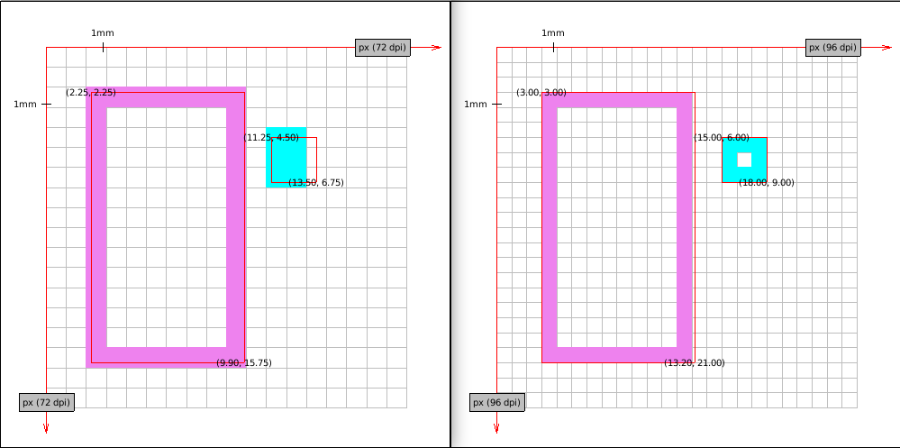
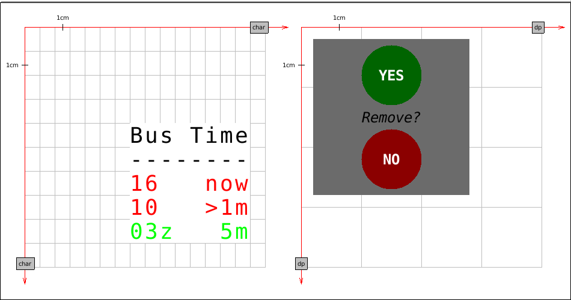
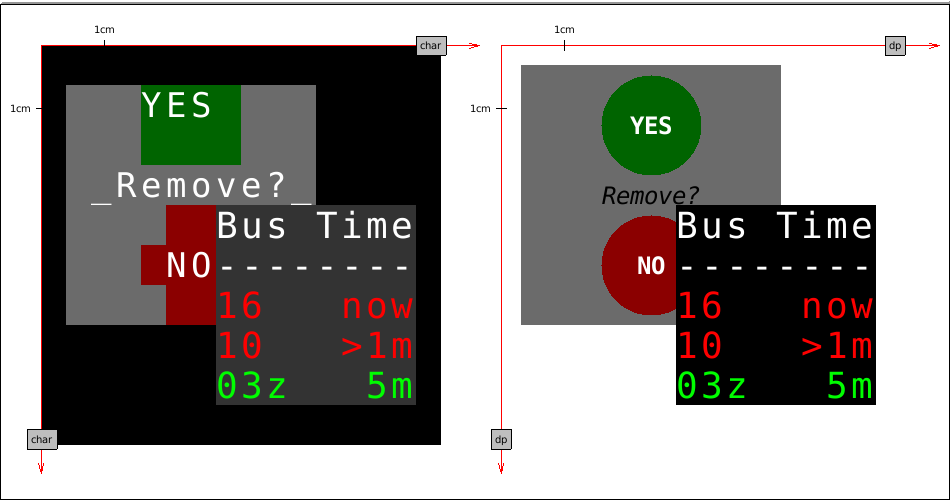

# Sheets as ideal forms

CLIM operates on various kinds of objects. Some are connected by an inheritance,
other by a composition and some are similar in different sense.

As programmers we often deal with the inheritance and the composition,
especially since OOP is a dominating paradigm of programming (no matter if the
central concept is the object or the function). Not so often we deal with the
third type of connection, that is the Form and the phenomena which is mere a
shadow mimicking it[^1].

Let us talk about sheets. Sheet is a region[^2] with an infinite resolution and
potentially infinite extent on which we can draw. Sheets may be arranged into
hierarchies creating a windowing system with child-parent relation. Sheet is the
Form with no visual appearance. What we observe is an approximation of the sheet
which may be hard to recognize when compared to other approximations.

[^1]: [Theory of forms](https://en.wikipedia.org/wiki/Theory_of_forms).

[^2]: And many other things.

## Physical devices

Sheet hierarchies may be manipulated without a physical medium but to make them
visible we need to draw them. CLIM defines `ports` and `grafts` to allow rooting
sheets to a display server. `medium` is defined to draw sheet approximation on
the screen[^3].

How should look a square with side length 10 when drawn on a sheet? Since it
doesn't have a unit we can't tell. Before we decide on a unit we choose we need
to take into consideration at least the following scenarios:

1. If we assume device-specific unit results may drastically differ (density may
vary from say 1200dpi on a printer down to 160dpi on a desktop[^4]!. The very
same square could have 20cm on a paper sheet, 10cm and 7cm on different displays
and 1cm on a terminal.  From the perspective of person who uses the application
this may be confusing because physical objects doesn't change size without a
reason.

2. Another possible approach is to assume the physical world distances measured
in millimeters (or inches if you must). Thanks to that object will have a
similar size on different mediums. This is better but still not good. We have to
acknowledge that most computer displays are pixel based. Specifying a distances
in millimeters will inevitably lead to worse drawing quality[^5] (compared to
the situation when we use pixels as the base unit). Moreover conversion from
millimeter values to pixel will most inevitably lead to work on floats.

3. Some applications may have specific demands. For instance application is
meant to run on a bus stop showing arrival times. Space of the display is very
limited and we can't afford approximation from high-density specification (in
pixels or millimeters) to 80x40 screen (5 lines of 8 characters with 5x8 dots
each). We need to be very precise and the ability to request a particular unit
size for a sheet is essential. Of course we want to test such application on a
computer screen.

I will try to answer this question in a moment. First we have to talk about the
`CLIM` specification and limitations imposed by McCLIM's implementaiton of
grafts.

[^3]: See some [general recommendations](http://bauhh.dyndns.org:8000/clim-spec/12-4.html).

[^4]: Technically it should be [PPI not DPI](https://99designs.com/blog/tips/ppi-vs-dpi-whats-the-difference/) (pixels per inch).

[^5]: Given programmer specifies sheet size in integers (like 100x100).

## Ports, grafts and McCLIM limitations

If port is a physical connection to a display server then graft is its screen
representation. The following picture illustrates how the same physical screen
may be perceived depending on its settings and the way we look at it.

As we can see graft has an orientation (`:default` starts at the top-left corner
like a paper sheet and `:graphics` should start at the bottom left corner like
on the chart).  Moreover it has units. Currently McCLIM will recognize
`:device`, `:inches`, `:millimeters` and `:screen-sized`[^11].

That said McCLIM doesn't implement graft in a useful way. Everything is measured
in pixels (which `:device` units are assumed to be) and only the `:default`
orientation is implemented. By now we should already know that pixels are a not
a good choice for the default unit. Also programmer doesn't have means to
request unit for a sheet (this is the API problem).

[^11]: Screen size unit means that the coordinate [1/2, 1/2] is exactly in the
    middle of the screens.

## Physical size and pixel size compromise

We will skip the third situation for now to decide what unit should we default
to. There are cognitive arguments for units based on a real world distances but
there are also and practical reasons against using millimeters – poor mapping to
pixels and the fact that CLIM software which is already written is defined with
assumption that we operate on something comparable to pixel.

Having all that in mind the default unit should
be
[device-independent pixel](https://en.wikipedia.org/wiki/Device-independent_pixel).
One of McCLIM long-term goals is to adhere
to [Material Design](https://material.io/) guidelines – that's why we will use
dip[^6] unit. 100dp has absolute value 15.875mm. On 160dpi display it is 100px,
on 96dpi display it is 60px, on 240dpi display it is 150px etc. This unit gives
us some nice characteristics: we are rather compatible with the existing
applications and we preserving absolute distances across different screens.

[^6]: [Density-independent pixel](https://material.io/guidelines/layout/units-measurements.html#units-measurements-density-independent-pixels-dp).

## How to draw a rectangle on the medium

Application medium may be a pixel-based screen, paper sheet or even a text
terminal. When the programmer writes the application he operates on dip units
which have absolute value 0.15875mm. It is McCLIM responsibility to map these
units onto the device. To be precise each graft needs to hold an extra
transformation which is applied before sending content to the display server.

Now we will go through a few example mappings of two rectangle borders[^7] drawn
on a sheet. The violet rectangle coordinates are `[5,5], [22,35]` and the cyan
rectangle coordinates are `[25,10], [30,15]`.

* MDPI display device units are dip and they match native units of our
  choosing. No transformation is required.

    

* Some old displays have density 72PPI. Not all coordinates map exactly to
  pixels - we need to round them[^3]. Notice that border is thicker and that
  proportions are a little distorted. On the other hand despite big change in
  resolution size of the object is similar in real world values.

  Windows Presentation Foundation declared 96PPI screen's pixel being the
  device-independent pixel because such displays were pretty common on
  desktops. Almost all coordinates map perfectly on this screen. Notice the
  approximation of the right side of the violet rectangle.

    

* Fact that the screen has higher density doesn't mean that coordinates mapping
  perfectly on a lower density screen will map well on a higher density
  one. Take this HDPI screen. Almost all coordinates are floats while on the
  MDPI display they had all integer values.

    

* Higher resolution makes rectangles look better (border line is thinner and
  distortions are less visible to the eye). Here is XXXHDPI:

    

* Some printers have a really high DPI, here is imaginary 2560 DPI printer.
  Funnily enough its accuracy exceeds our screen density so the red border which
  is meant to show the "ideal" rectangle is a little off (it's fine if we scale
  the image though).

    

* Until now we've seen some screens with square pixels (or dots). Let's take a
  look at something with a really low density - a character terminal. To make
  the illustration better we assume an absurd terminal which has 5x8 DP per
  character (too small to be seen by a human eye). Notice that the real size of
  the rectangles is still similar.

    

It is time to deal with `graphics` orientation (Y-axis grows towards top). An
imaginary plotter with 80DPI resolution will be used to illustrate two solutions
(the first one is wrong!). Knowing the plotter screen height is important to
know where we start the drawing.

* Graft reverts Y axis and sends the image to the plotter. Do you see what is
  wrong with this picture? We have defined both rectangles in default
  orientation, so our drawing should look similar disregarding the medium we
  print on. We do preserved the real size but we don't preserve the image
  orientation – cyan rectangle should be higher on the plot.

    

* Correct transformation involves reverting Y axis and translating objects by
  the screen height. See the correct transformation (on 80DPI and on MDPI
  plotter).

    

[^7]: Ideal border is composed of lines which are 1-dimensional objects which
    doesn't occupy any space. Red border in drawings marks "ideal" object
    boundaries. Points are labeled in device units (with possible fractions).

## Sheets written with a special devices in mind

There is still an unanswered question - how can we program applications with a
specific device limitations in mind? As we have discussed earlier default sheet
unit should be dip and default sheet orientation is the same as a paper
sheet's[^8].

Writing an application for a terminal is different than writing an application
for a web browser. Number of characters which fit on the screen is limited,
drawing shapes is not practical etc. To ensure that the application is rendered
correctly we need a special kind of sheet which will operate on units being
characters. Take a look at the following example.

The first sheet base unit is a character of a certain physical size. We print
some information on it in various colors. Nothing prevents us from drawing a
circle[^9] but that would miss the point. We use character as a unit because we
don't want rounding and approximation. Background and foreground colors are
inherited.

The second sheet base unit is dip. It has two circles, solid grey background and
a few strings (one is written in italic).

Ideally we want to be able to render both sheets on the same physical
screen. The graft and the medium will take care of the sheet
approximation. Effect should look something like this.

The first screen is a terminal. Circles from the second sheet are approximated
with characters and look ugly but the overall effect resembles the original
application. Proportions are preserved (to some degree). We see also the
terminal-specialized sheet which looks exactly as we have defined it.

The second screen is mDPI display. The second sheet looks very much like
something we have defined. What is more interesting though is our first sheet –
it looks exactly the same as on the terminal.

[^8]: Providing means to change defaults requires additional thought and is a
    material for a separate chapter. McCLIM doesn't allow it yet.

[^9]: As we have noted sheets are ideal planar spaces where line thickness is 0
    and there is nothing preventing us from using fractions as coordinates.

<!-- Writing applications for terminal require a special kind of focus: the space is -->
<!-- very limited and off-by-one errors yield a huge difference in visual apperance in -->
<!-- the applicaiton. Rounding from dip is a big no for some use cases. On the other -->
<!-- hand we don't want to provide a separate implementation of each pane and gadget -->
<!-- (which are a special kinds of sheets) in case our application declares non-default -->
<!-- units. This two concerns yield the following conclusion: in the application frame -->
<!-- different sheets may have different units and orientation (and effectively different -->
<!-- grafts engrafted to their mediums). -->

<!-- It is important to remember, that this behavior -->
<!-- must be transparent from the perspective of other sheets – we need to find a clever -->
<!-- way to convert sheet-specific unit to the default unit dip. If sheet is grafted -->
<!-- then this should be easy enough, but what about ungrafted sheet? What is the size -->
<!-- of a character? Also spec clearly says, that sheet hierarchy may be grafted only -->
<!-- to one graft. Hmm, so maybe we can't really reuse the components..  -->

<!-- sheet-region is in sheet coordinate system! -->
<!-- http://bauhh.dyndns.org:8000/clim-spec/7-3.html -->
<!-- move-and-resize-sheet, sheet-transformation -->

# Port and graft protocols

Now we know *what* we want. Time to think about *how* to achieve it. Let me
remind you what kind of objects we are dealing with:

* Port is a logical connection to a display server. For instance it may contain
  a foreign handler which is passed to the external system API. It is
  responsible for the communication – configuring, writing to[^10] and reading
  from a device we are connected to.

* Graft is a logical screen representation on which we draw. It is responsible
  for all transformations necessary to achieve desired effect on the physical
  screen. The same port may have many associated grafts for applications with
  different units and orientations.

* Medium is a representation of the sheet on a physical device. Sheet is the
  Form which is a region and may be drawn – it doesn't concern itself with
  physical limitations. We will cover only medium's basics here.

[^10]: Sometimes we deal with devices which we can't take input from – for
    instance a printer, a PDF render or a display without other peripherals.
