# Sheets as ideal forms

In CLIM we have a variety of different kinds of objects. Some of them are
connected by an inheritance, other by a composition and some are similar due to
the idea standing behind them.

As programmers we often deal with the inheritance and the composition,
especially since OOP is a dominating paradigm of programming (no matter if the
central concept is the object or the function). Not so often we deal with the
third type of connection, that is the Form and the phenomena which is mere a
shadow mimicking it[^1].

Let us talk about sheets. Sheet has infinite extent and resolution. Sheets may
be arranged into hierarchies effectively constituting windowing system with
child-parent relation and at the same time it is a drawing plane[^2]. Sheet is
the Form with no visual appearance. What we observe is an approximation of the
Form which may be hard to recognize when compared to other realizations.

[^1]: [Theory of forms](https://en.wikipedia.org/wiki/Theory_of_forms).

[^2]: And many other things.

## Physical devices

Sheet hierarchies may be manipulated without any physical medium, but to make
them visible we need to draw them. CLIM defines `ports` and `grafts` to allow
rooting sheets to the display server. To draw the sheet approximation `medium`
is defined[^3].

When we draw a square on a sheet which side length doesn't have any unit how
should it look? What should be its appearance size? This question is far from
trivial. We need to take into consideration at least these three scenarios:

1. If we assume device-specific unit results may drastically differ (density may
vary from say 300dpi on a printer, through 160dpi on desktop[^4] down to
character-based terminals with around 16dpi!). The very same square may have
20cm on the sheet, 10cm and 7cm on different displays and 1cm on the terminal.
From the perspective of person who uses the application this may be confusing
because physical objects doesn't change size depending on their location.

2. Another possible approach is to assume the physical world distances measured
in millimeters (or inches if you must). That way objects will have a similar size
independent of the medium they are drawn on. This is better, but not good. We
have to acknowledge that most computer displays are pixel based. Specifying our
distances in millimeters will inevitably lead to bigger distortions in the image
(compared to situation if we had used pixels) so the drawing quality would suffer[^5].
Moreover conversion from integral millimeter values to pixels will inevitably lead us
to work on fractions what may hurt the performance.

3. Since we are engineers we may have a specific demands. We know, that our program
will run on the terminal or on a screen in the bus showing the current
station. Since the space is very limited we can't afford approximation from
high-density description (in pixels or millimeters) to 80x24 console or 80x16
HD44780 LCD display (2 lines of 8 characters with 5x8 dots each). We need to be
very precise with such interfaces, but we want to test software on the computer,
so the ability to request a particular unit size for the sheet is essential to
us. Needless to say, we may want to reuse the components we have created for
these small displays in other applications which are pixel based.

We will try to answer this question in a moment. First we have to talk about
the current CLIM specification and limitations imposed by the McCLIM implementaiton
of grafts.

[^3]: See some [general recommendations](http://bauhh.dyndns.org:8000/clim-spec/12-4.html).

[^4]: Technically it should be [PPI not DPI](https://99designs.com/blog/tips/ppi-vs-dpi-whats-the-difference/) (pixels per inch).

[^5]: Given programmer specifies sheet size in integers (like 100x100).

## Ports, grafts and McCLIM limitations

If port is a physical connection to the display server, then graft is its screen
representation. The following picture illustrates how the same physical screen
may be perceived depending on its settings and way we look at it (device units
like pixels or physical units like millimeters.

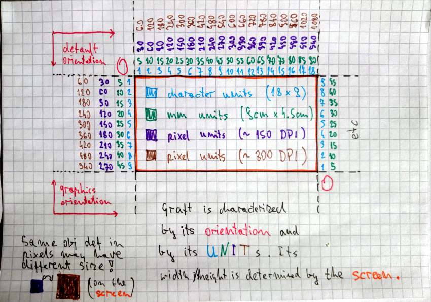

As we can see graft has an orientation (`:default` starts at top-left corner like
a sheet and `:graphics` should start at the bottom left corner like a chart).
Moreover graft has units. Currently McCLIM will recognize `:device`, `:inches`,
`:millimeters` and `:screen-sized` (the last one is measured in screen size,
so the coordinate [1/2, 1/2] means exactly the middle of the screens).

That said McCLIM doesn't implement graft in a way which would make it meet its
full potential. Everything is in practice measured in pixels (which `:device`
units are assumed to be) and only the `:default` orientation is implemented.
By now we should already know, that pixels are a big no-no if we take into account
how people perceive distances and that we are engineers who may desire to create
specialized applications which will work best on some uncommon devices. That's
not all, programmer doesn't have practical means to request a particular graft
type for his sheet (he is always served by the default), so it is not only a problem
of the implementation but also problem of the API.

## Physical size and pixel size compromise

We will skip third situation now to resolve conflict between dilemma what should
be default unit for sheets when we render them. There are cognitive arguments for
unit based on real distance but there are also and performance concerns against
using millimeters. For instance on the `mdpi` display (160dpi) 100px is around
15.875mm on the screen. The fact that CLIM software already written is defined
with something comparable to pixels in mind is not without a meaning too.

Taking that into account the answer to our two first cases is to use
[Device-independent pixel](https://en.wikipedia.org/wiki/Device-independent_pixel).
One of McCLIM long-term goals is to adhere to [Material Design](https://material.io/)
principles. Because of that we will use dip[^6] unit. 100dp has absolute value
15.875mm which equals to 100px on 160dpi display, 60px on 96dpi display, 150px on
240dpi display etc. That gives us nice characteristics which are rather compatible
with the existing applications yet preserving absolute distances across different
screens.

[^6]: [Density-independent pixel](https://material.io/guidelines/layout/units-measurements.html#units-measurements-density-independent-pixels-dp).

## How to draw a rectangle on the medium

As we have noted that medium may be a pixel-based screen, printer sheet or even
a text terminal. When a programmer writes the application by default he operates
on dip units which have absolute value 0.15875mm. It is McCLIM responsibility to
map these units onto the device. To be precise each graft needs to hold an extra
transformation which is applied before sending content to the display server.

Now we will go through a few example mappings of two rectangle borders[^7] drawn
on the sheet. The violet rectangle is defined by coordinates `[5,5], [22,35]`
and the cyan rectangle is defined by coordinates `[25,10], [30,15]`.

* MDPI display device units are dip so they match native units of our
  choosing. That means that no particular transformation is required.

    

* Some old displays had density 72PPI. All coordinates doesn't map exactly so we
  need to round them to the closest pixel[^3]. Note that border is thicker and
  that proportions are a little distorted. On the other despite drastic change
  of resolution size of the object is more or less the same as we specified in
  real world values.

    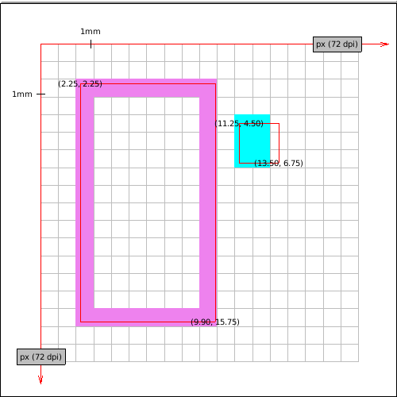

* Windows Presentation Foundation declared 96PPI screen pixels device-independent
  pixels because such displays were pretty common on desktops. Our coordinates
  map almost perfectly to this screen. Notice the approximation of right side of
  the violet rectangle.
  
    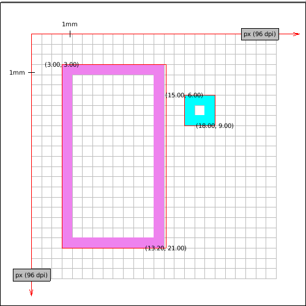

* Fact that the screen has higher density doesn't mean that coordinates which map
  perfectly on lower density screen will map well on the higher density one. Take
  this HDPI screen. We have fractions in almost all coordinates while on MDPI
  display they were all integers.

    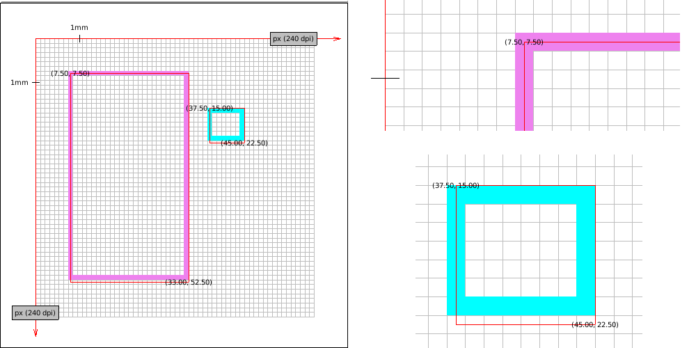
    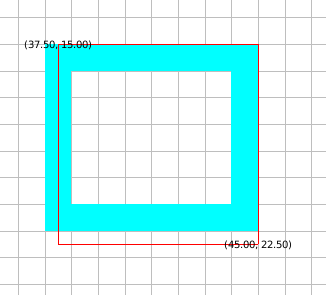
    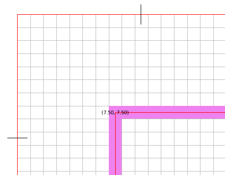

* Higher the resolution better our rectangles look like (border line is thinner,
  approximated mapping is less visible to the eye). Here is XXXHDPI:

    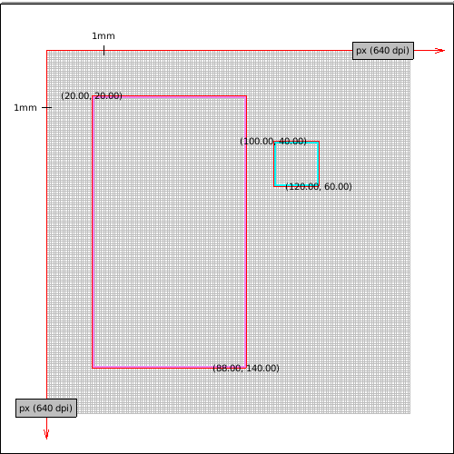
    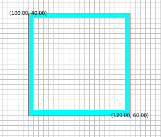

* Some printers have a really high DPI, here is imaginatory 2560 DPI printer.
  Funnily enough its accuracy exceeds our approximation density so the red
  border which is meant to show the ideal rectangle is a little off (it's fine
  if we scale the image though).

    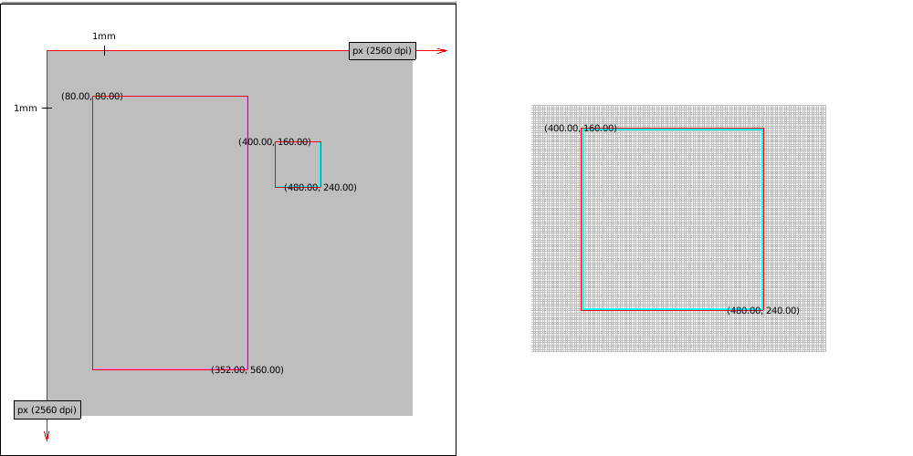
    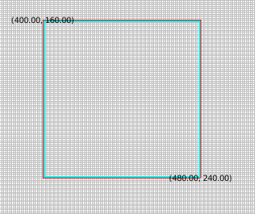

* We've been analyzing high density screens with square pixels (or dots). Let's
  take a look at something with low density - a character terminal. To make it
  better illustration we assume some absurd terminal which has 5x8 DP per
  character (practial minimum to cover whole alphabet, but too small to be seen
  by human eye). Notice, that the real size is still similar.

    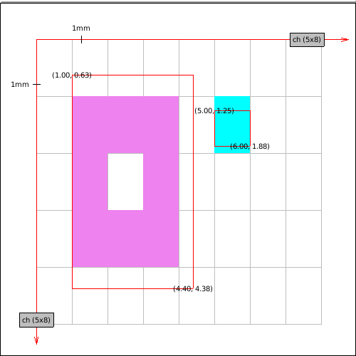

Now it is time to deal with graphics orientation (Y-axis grows towards top). We
will use imaginatory plotter with 80DPI resolution to illustrate two solutions
(where first is wrong!). It is important to keep in mind, that we need additional
bit of information to perform succesful transformation – maximum size of the
device. This is important, because we need to settle device coordinate `[0,0]`
in our infinite drawing plane (for instance it could start at `[0,500]`). Otherwise
we wouldn't know where to start plotting.

* Graft simply reverts Y axis and sends the image to the plotter. Do you see
  what is wrong with this picture? We have defined both rectangles in default
  orientation, so our drawing should look similar disregarding the medium we
  print on. While we preserved the real size we don't preserve image orientation
  – cyan rectangle should be higher on the plot.

    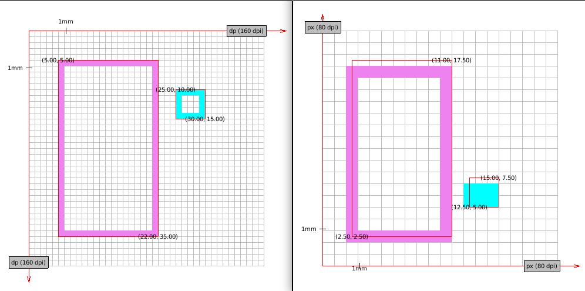

* Correct transformation involves reverting Y axis and translating objects by
  the screen height. See correct transformation (on 80DPI and on MDPI plotter).

    

[^7]: Ideal border is composed of lines which are 1-dimensional objects which
    doesn't occupy any space. Red border in drawings marks "ideal" object
    boundaries. Points are labeled in device units (with possible fractions).

## Sheets written with a special devices in mind

There is one more unanswered question - how can we program applications with a
specific device limitations in mind? As we have discussed earlier default sheet
unit should be dip and default sheet orientation is the same as a physical
sheet. Answering it requires some additional thought and it is a material for a
separate chapter. We will focus on port and graft implementation instead.

<!-- Writing applications for terminal require a special kind of focus: the space is -->
<!-- very limited and off-by-one errors yield a huge difference in visual apperance in -->
<!-- the applicaiton. Rounding from dip is a big no for some use cases. On the other -->
<!-- hand we don't want to provide a separate implementation of each pane and gadget -->
<!-- (which are a special kinds of sheets) in case our application declares non-default -->
<!-- units. This two concerns yield the following conclusion: in the application frame -->
<!-- different sheets may have different units and orientation (and effectively different -->
<!-- grafts engrafted to their mediums). -->

<!-- It is important to remember, that this behavior -->
<!-- must be transparent from the perspective of other sheets – we need to find a clever -->
<!-- way to convert sheet-specific unit to the default unit dip. If sheet is grafted -->
<!-- then this should be easy enough, but what about ungrafted sheet? What is the size -->
<!-- of a character? Also spec clearly says, that sheet hierarchy may be grafted only -->
<!-- to one graft. Hmm, so maybe we can't really reuse the components..  -->

<!-- sheet-region is in sheet coordinate system! -->
<!-- http://bauhh.dyndns.org:8000/clim-spec/7-3.html -->
<!-- move-and-resize-sheet, sheet-transformation -->

